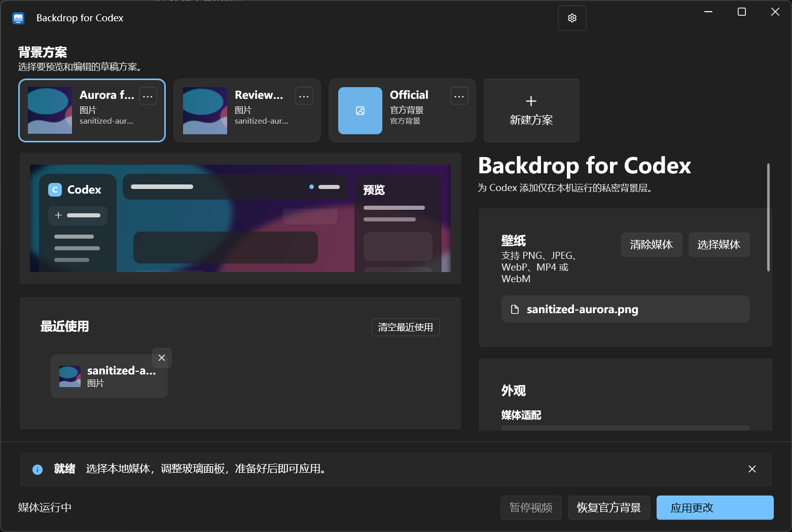

# Backdrop for Codex

An unofficial, open-source companion for **Windows 11 x64** that places a local image or a muted, looping video behind the workspace of the official Microsoft Store/MSIX Codex desktop app.

**Does not modify the Codex package · Does not upload local media to a project-operated service · Does not read chats · Does not collect telemetry**

[](https://github.com/TogawaSakiko-desuwa/backdrop-for-codex/releases/latest)
[](https://github.com/TogawaSakiko-desuwa/backdrop-for-codex/actions/workflows/ci.yml)
[](LICENSE)

[Latest release](https://github.com/TogawaSakiko-desuwa/backdrop-for-codex/releases/latest) · [Quick start](#quick-start) · [Security](SECURITY.md) · [Privacy](PRIVACY.md) · [中文 README](README.md)

> [!CAUTION]
> Backdrop for Codex is an independent community project. It is not affiliated with, sponsored, endorsed, or supported by OpenAI or Microsoft.
> It works through the Chrome DevTools Protocol (CDP) on a local loopback address. CDP is a privileged debugging interface, and a malicious process in the same Windows user session may still attempt to connect.
> Never run the companion as administrator or expose the debugging port beyond loopback. Fully exit Codex when you are finished. See the [security policy](SECURITY.md) and [threat model](THREAT_MODEL.md) for details.



## Quick start

1. Install the official Microsoft Store/MSIX x64 Codex desktop app on Windows 11 x64.
2. Download `BackdropForCodex-vX.Y.Z-win-x64.zip` from [GitHub Releases](https://github.com/TogawaSakiko-desuwa/backdrop-for-codex/releases/latest). We recommend downloading the matching `BackdropForCodex-vX.Y.Z-SHA256SUMS.txt` and SPDX SBOM as well.
3. Verify the release, then extract the ZIP into an empty directory writable by your standard user account.
4. Fully exit every Codex process. Start `BackdropForCodex.exe`, read the CDP risk notice, and accept it if the boundary is appropriate for your machine.
5. Create or select a profile, choose or drop a local image/video, adjust the preview, and apply it. You can also clear the media and apply an empty profile to use the official Codex background.
6. After the first successful media activation, the companion attempts to create or update `Codex（动态背景）.lnk`. You can use that shortcut for future enhanced launches. A shortcut failure does not affect the currently active background, and you can retry from the workbench.

> [!NOTE]
> A release may not have an Authenticode signature. SHA-256 proves that downloaded bytes match the published checksum, and a GitHub artifact attestation can establish build provenance. Neither replaces source review, Windows code signing, or endpoint protection.

<details>
<summary><strong>Verify SHA-256 and GitHub build provenance</strong></summary>

Open PowerShell in the download directory and replace `vX.Y.Z` with the actual version:

```powershell
Get-FileHash .\BackdropForCodex-vX.Y.Z-win-x64.zip -Algorithm SHA256
Get-Content .\BackdropForCodex-vX.Y.Z-SHA256SUMS.txt
```

Confirm that the ZIP hash exactly matches the checksum manifest. If [GitHub CLI](https://cli.github.com/) is installed, you can also verify build provenance:

```powershell
gh attestation verify .\BackdropForCodex-vX.Y.Z-win-x64.zip `
  --repo TogawaSakiko-desuwa/backdrop-for-codex
```

`BackdropForCodex-vX.Y.Z-win-x64.spdx.json` in the same release is the machine-readable software bill of materials.

</details>

### Usage notes

- The profile strip manages multiple background profiles. Creating, duplicating, renaming, deleting, or selecting a profile—and choosing media or changing presentation settings—edits only the draft. The single Apply action at the bottom commits the draft and then attempts to change Codex.
- The workbench distinguishes the draft, the saved desired snapshot, and the snapshot that is actually active. If persistence succeeds but activation does not, it reports “saved but not activated” instead of presenting the desired values as active.
- Apply uses latest-wins scheduling. During rapid submissions, only the newest pending request is retained. Older requests are safely canceled or reported as superseded; an atomic save that already completed is not falsely presented as rolled back.
- Closing the main window or pressing `Alt+F4` hides the workbench in the notification area. An active background keeps running.
- Restore Official cancels unfinished Apply work and removes only media resources owned by this companion. It does not change the saved desired profile. Apply again to reactivate the selected profile.
- An empty profile is a normal, durable profile. Applying it manually does not start Codex merely to display the official background. When an enhanced shortcut encounters an empty profile, it verifies the official package and starts Codex normally without debugging arguments or a CDP session.
- Only Exit in the notification-area menu ends the companion and cleans up resources it owns. If the draft is dirty, an actual exit, full reset, or V1-backup restore offers “discard and continue” or “cancel”; it never applies the draft implicitly.
- Exiting the companion does not close a CDP port owned by Codex. Fully exit Codex to close that port.

## Features

- Local PNG, JPEG, and WebP images, plus muted looping MP4 and WebM videos.
- Multiple profiles with create, duplicate, rename, delete, keyboard selection, and a formal empty/Official state.
- Contain, cover, and stretch fit modes. Cover mode supports direct focus dragging, arrow-key adjustment, and reset-to-center.
- Independent dark/light theme overlays, panel opacity, and backdrop blur with a local preview before Apply.
- File picker, single-file drag and drop, and up to eight recent media references. Missing paths are visibly marked and can be removed individually.
- System, light, and dark application themes, with priority given to Windows high-contrast and related accessibility settings.
- A horizontally scrolling profile strip with context menus, focus restoration, UI Automation names and selection state, reduced-motion support, and 125%–200% scaling. The window keeps its two-column/stacked breakpoint at 960 px and a 640×520 minimum size.
- Video pause/resume, workbench reopen, Restore Official, and Exit controls from the notification area.
- External companion architecture: the Codex MSIX package is never modified, replaced, or re-signed.

## Profiles and state semantics

Version 1.4.0 exposes the existing schema 2 profile model throughout the workbench, application layer, and runtime. It does not introduce Settings V3 or add serialized fields. A 1.3.5-compatible reader can still read and preserve the 1.4.0 multi-profile document.

Each profile has its own media reference and presentation settings. Duplicating a profile reuses the same media ID while copying all profile settings. Deleting a referenced profile requires a replacement profile and atomically rebinds every affected semantic region. Orphaned media references remain in the catalog in 1.4.0; there is no automatic garbage collector.

The workspace keeps three snapshots:

- `Draft` is the current editable state. Profile selection, preview changes, and profile CRUD affect only this snapshot.
- `SavedDesired` is the last schema 2 snapshot whose atomic save completed.
- `ActiveSnapshot` is the saved snapshot actually represented by the current runtime resources. It can be absent even when `SavedDesired` exists.

The runtime surface is explicit:

- `MediaActive` means a media ID and injection generation are actually active.
- `Official` means this companion currently owns no active media surface.
- `Faulted` means safety validation or injection failed; a structured error and the real cleanup result are retained.
- `Disconnected` means Codex was lost and cleanup of companion-owned resources was confirmed.

An Apply operation can complete as `MediaActive`, `Official`, `SavedButNotActivated`, `Superseded`, `Canceled`, or `Failed`. Progress and completion events carry a revision, so stale results cannot replace newer UI state.

## Compatibility and limitations

| Item | Current status |
| --- | --- |
| Windows 11 x64 | Supported and the only target platform |
| Official Microsoft Store/MSIX x64 Codex | Supported after package, process, session, loopback endpoint, and unique-page verification |
| Multiple eligible Codex work pages | Waits for at most about 10 seconds for one unique target; persistent ambiguity rejects the Apply |
| PNG, JPEG, WebP | Supported |
| MP4, WebM | Supported as muted looping video |
| Local media limits | Ordinary files on local disks only; image up to 512 MiB, 32,768 px per side, and approximately 33.5 MP; video up to 8 GiB |
| Settings format | Remains schema 2; 1.4.0 adds no serialized field, and 1.3.5 can read and preserve multi-profile data |
| Win32 portable, web, CLI, or other Codex clients | Not supported |
| Windows 10, Windows on Arm, macOS, Linux | Not supported |
| Per-region wallpapers, video audio, Wallpaper Engine, or an independent wallpaper per Codex window | Not supported |

Presentation compatibility is decided from the actual page structure, not the Codex version number alone. A Codex update can change page structure, process behavior, or debugging behavior and temporarily affect some or all background effects. A failed safety check never falls through to injection.

## Security and privacy

- The companion accepts only a strictly verified official Store/MSIX Codex package and a strict IPv4 loopback CDP endpoint. Loopback is not a security boundary against another process running as the same user.
- It does not alter or bypass Codex Content Security Policy (CSP). A verified local file is bound to a controlled page file input and loaded through a `blob:` URL permitted by the page.
- It starts no media HTTP server and creates no media endpoint or access token. Media is not sent through a project-operated network service.
- It does not read chats, proxy Codex/OpenAI traffic, send telemetry, perform behavioral analytics, or submit project-operated crash reports.
- Settings are stored for the current Windows user under `%LOCALAPPDATA%\CodexWallpaper`. They can contain multiple profiles, absolute media paths, semantic-region bindings, and recent-media references.
- A diagnostic report is created only after an explicit user export. It uses a fixed allowlist of fields and is never uploaded automatically.
- The single playback slot is bound to an ownership token. A stale request can release only the lease and injection generation it owns; it cannot clean up a newer background. Replacement, Restore Official, and Exit remove only resources owned by this companion.
- The CDP port remains owned by Codex and closes only when Codex fully exits.

Read the full documents before using the companion in a sensitive environment:

- [Security policy](SECURITY.md)
- [Threat model](THREAT_MODEL.md)
- [Privacy notice](PRIVACY.md)

## How it works

1. The workspace represents `Draft`, `SavedDesired`, and `ActiveSnapshot` as separate validated, deeply copied schema 2 snapshots. An edit cannot impersonate persistence or activation.
2. One actor serializes setting writes, Codex-session operations, and the single playback slot by monotonic activation revision. A successful atomic save is the durable commit point. An older revision cannot overwrite a newer state.
3. For a media profile, the local-file provider uses one read-only handle to resolve the final ordinary local file and validate identity, format, size, and image dimensions. The canonical path and actual media kind are saved back into the same `MediaReference`.
4. The runtime reacquires a fixed lease from that saved snapshot, then validates the official Codex package, process, Windows session, strict IPv4 loopback listener, CDP browser/socket/target, and one unique work page in the established fail-closed order.
5. Only after safety verification does the companion bind the verified file to its page-owned input through local CDP. The page loads it with a CSP-native `blob:` URL.
6. The active file lease, playback slot, and injected page resources carry an ownership token or generation. Replacement, Restore Official, and Exit remove only nodes, styles, URLs, and media resources the operation actually owns.

Activation revisions and injection generations are independent counters. A runtime-equivalent Apply can promote a newer saved snapshot to `ActiveSnapshot` without installing a new generation. Runtime equivalence considers only the effective Global media and its fit, focus, glass, and overlay values. Profile names, IDs, hidden bindings, recents, risk state, sound/performance placeholders, and deprecated markers do not cause reinjection. For an empty profile, style differences do not change the Official surface.

More detailed security invariants and review checks are in the [threat model](THREAT_MODEL.md).

## Build from source

Prerequisites: Windows 11 x64 and .NET SDK `10.0.301` or a later patch in the same feature band. SDK selection follows [`global.json`](global.json).

```powershell
dotnet restore .\BackdropForCodex.slnx --locked-mode
dotnet build .\BackdropForCodex.slnx --configuration Release --no-restore
dotnet test .\BackdropForCodex.slnx `
  --configuration Release `
  --filter "Category!=Integration"
dotnet run --project .\src\BackdropForCodex.App\BackdropForCodex.App.csproj
```

The 1.4.0 line contains 521 non-integration automated cases. A test count is not a verification result: only an actual recorded run may be reported as passed. Environment-dependent Edge/CDP, current-machine Codex identity, notification-area, and UI Automation checks must be recorded individually as **not verified** when they were not run or their prerequisites were unavailable. They must never be counted as passed by omission.

See [CONTRIBUTING.md](CONTRIBUTING.md) for publish parameters, formatting, DCO, and implementation constraints. See [tests/README.md](tests/README.md) for concurrency checkpoints, integration tests, and the notification-area smoke test.

## Documentation and contributing

- [中文 README](README.md)
- [Changelog](CHANGELOG.md)
- [Contributing guide](CONTRIBUTING.md)
- [Security policy](SECURITY.md)
- [Threat model](THREAT_MODEL.md)
- [Privacy notice](PRIVACY.md)
- [Test guide](tests/README.md)
- [Third-party notices](THIRD_PARTY_NOTICES.md)

Bug fixes, documentation improvements, and discussed feature changes are welcome. Every commit must carry a DCO-compliant `Signed-off-by` line as described in [DCO.md](DCO.md). Report security or privacy issues privately through the process in [SECURITY.md](SECURITY.md), not in a public issue.

## License and notices

The project is available under the [Apache License 2.0](LICENSE). Third-party components remain under their respective licenses; see [THIRD_PARTY_NOTICES.md](THIRD_PARTY_NOTICES.md) and the SBOM included with a release.

“OpenAI,” “Codex,” “Microsoft,” “Windows,” and related names and marks may belong to their respective owners. They are used only to describe compatibility. No trademark license, affiliation, sponsorship, or endorsement is implied.
