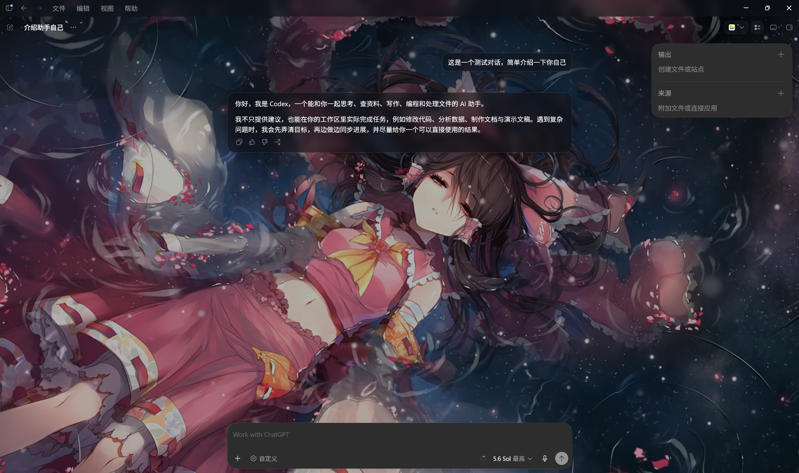
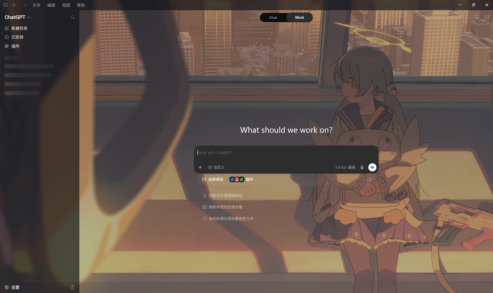
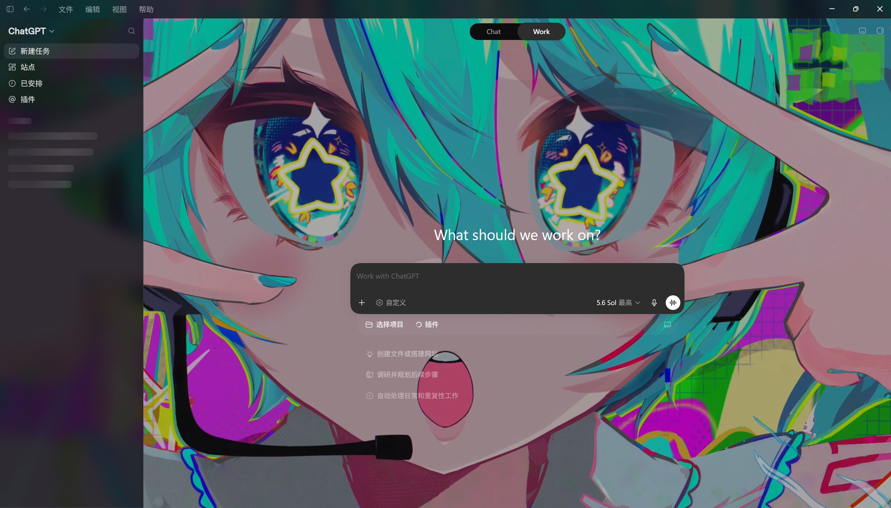
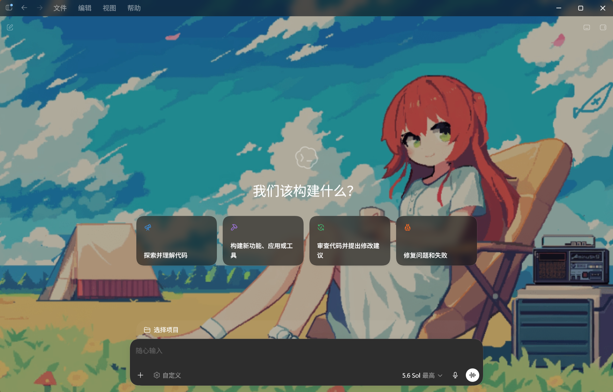

<p align="center">
  <strong>简体中文</strong> · <a href="README.en.md">English</a>
</p>

# Backdrop for Codex

一个面向 **Windows 11 x64** 的非官方开源伴侣：让官方 Microsoft Store / MSIX Codex 桌面应用使用本地图片或静音循环视频作为工作区背景。

**不修改 Codex 安装文件 · 不向项目自有服务上传本地媒体 · 不读取聊天 · 不收集遥测**

[](https://github.com/TogawaSakiko-desuwa/backdrop-for-codex/releases/latest)
[](https://github.com/TogawaSakiko-desuwa/backdrop-for-codex/actions/workflows/ci.yml)
[](LICENSE)

[**下载 Windows 11 x64 便携版 →**](https://github.com/TogawaSakiko-desuwa/backdrop-for-codex/releases/latest)

无需安装 · 使用普通用户权限运行 · 支持本地 PNG、JPEG、WebP、MP4 和 WebM

> [!CAUTION]
> Backdrop for Codex 是独立社区项目，与 OpenAI 或 Microsoft 无隶属、赞助、认可或支持关系。它通过本机回环地址上的 Chrome DevTools Protocol（CDP）工作；请勿以管理员身份运行或转发调试端口，使用完毕后应完全退出 Codex。详情见[安全说明](SECURITY.md)和[威胁模型](THREAT_MODEL.md)。

## 效果展示

<p align="center">
  
</p>

<p align="center"><sub>对话工作区中的实际背景效果</sub></p>

<table>
  <tr>
    <td width="33%"></td>
    <td width="33%"></td>
    <td width="34%"></td>
  </tr>
  <tr>
    <td align="center">暖色背景与半透明界面</td>
    <td align="center">高饱和背景与可读性遮罩</td>
    <td align="center">全窗口背景与内容卡片</td>
  </tr>
</table>

<p align="center"><sub>示例媒体仅用于展示本地背景效果，不随本项目或 Release 发布。</sub></p>

## 下载与快速开始

| Release 文件 | 用途 |
| --- | --- |
| `BackdropForCodex-vX.Y.Z-win-x64.zip` | 普通用户下载；解压后直接运行 |
| `BackdropForCodex-vX.Y.Z-SHA256SUMS.txt` | 核对下载文件的 SHA-256 |
| `BackdropForCodex-vX.Y.Z-win-x64.spdx.json` | 机器可读的 SPDX SBOM |

1. 在 Windows 11 x64 上安装官方 Microsoft Store / MSIX x64 Codex。
2. 从 [GitHub Releases](https://github.com/TogawaSakiko-desuwa/backdrop-for-codex/releases/latest) 下载 `win-x64.zip`，解压到普通用户可写的空目录。
3. 完全退出所有 Codex 进程，然后启动 `BackdropForCodex.exe`，阅读并确认 CDP 风险提示。
4. 新建或选择背景方案，拖入本地图片或视频，调整预览后点击“应用更改”。
5. 首次媒体激活成功后，应用会尝试在桌面创建 `Codex（动态背景）.lnk`；以后可用它执行增强启动。

> [!NOTE]
> 当前发布物可能没有 Authenticode 代码签名。遇到 Windows SmartScreen 提示时，请先确认文件来自本仓库的 Release，并核对 SHA-256 或 GitHub artifact attestation。

<details>
<summary><strong>验证 SHA-256 与 GitHub 构建来源</strong></summary>

在下载目录打开 PowerShell，并把 `vX.Y.Z` 替换为实际版本：

```powershell
Get-FileHash .\BackdropForCodex-vX.Y.Z-win-x64.zip -Algorithm SHA256
Get-Content .\BackdropForCodex-vX.Y.Z-SHA256SUMS.txt
```

确认 ZIP 的散列与清单完全一致。安装 [GitHub CLI](https://cli.github.com/) 后还可以验证构建来源：

```powershell
gh attestation verify .\BackdropForCodex-vX.Y.Z-win-x64.zip `
  --repo TogawaSakiko-desuwa/backdrop-for-codex
```

</details>

## 核心功能

- 使用本地 PNG、JPEG、WebP 图片或静音循环 MP4、WebM 视频。
- 管理多个背景方案，包括新建、复制、重命名、删除和 Official 空方案。
- 提供“完整显示”“裁剪填满”“拉伸”三种适配模式，并支持拖动焦点和方向键微调。
- 分别调整浅色/深色主题遮罩、面板不透明度和背景模糊，应用前即可预览。
- 支持文件选择、单文件拖放、最近使用记录、视频暂停与继续。
- 快速重复应用时以最后一次操作为准，旧请求不会覆盖更新的背景。
- 从通知区域重新打开工作台、恢复官方背景或完全退出伴侣。
- 作为外部伴侣运行，不修改、替换或重新签名 Codex 的 MSIX 包。

<details>
<summary><strong>查看背景方案工作台</strong></summary>


</details>

## 兼容性与限制

| 项目 | 当前状态 |
| --- | --- |
| Windows 11 x64 | 支持，也是唯一目标平台 |
| 官方 Microsoft Store / MSIX x64 Codex | 支持；使用前会核验包、进程、会话、回环端点和目标页面 |
| PNG、JPEG、WebP | 支持 |
| MP4、WebM | 支持静音循环播放 |
| 本地媒体限制 | 仅本地普通磁盘文件；图片不超过 512 MiB、单边 32,768 像素和约 33.5 MP，视频不超过 8 GiB |
| Win32 便携版、网页、CLI、Windows 10、Windows on Arm、macOS、Linux | 不支持 |
| 多窗口独立壁纸、分区域壁纸、视频声音、Wallpaper Engine | 当前不支持 |

兼容能力按实际页面结构判断，而不是只看 Codex 版本号。Codex 更新可能改变页面结构、进程模型或调试行为，从而暂时影响背景效果；安全核验失败时，应用不会继续注入。

## 常见问题

### 关闭窗口后为什么还在运行？

点击关闭按钮或按 `Alt+F4` 只会把工作台隐藏到通知区域，已应用背景会继续运行。请从通知区域菜单选择“退出”以结束伴侣。

### 找不到 Codex，或者应用背景失败怎么办？

确认使用的是官方 Microsoft Store / MSIX x64 Codex，且 Backdrop for Codex 没有以管理员身份运行。完全退出所有 Codex 进程后，重新打开工作台或使用 `Codex（动态背景）.lnk`。仍然失败时，可在设置中导出诊断报告，并通过 [GitHub Issues](https://github.com/TogawaSakiko-desuwa/backdrop-for-codex/issues/new/choose) 提交问题。

### Codex 更新后背景失效怎么办？

先恢复官方背景并完全退出 Codex，再查看[最新 Release](https://github.com/TogawaSakiko-desuwa/backdrop-for-codex/releases/latest)是否包含兼容性更新。不要尝试绕过失败的安全核验。

### 如何恢复官方背景？

工作台和通知区域菜单都提供“恢复官方背景”。该操作只清理当前注入，不删除已经保存的背景方案；再次点击“应用更改”即可恢复所选方案。

### 如何完整重置或卸载？

1. 打开设置，在“危险区”选择“重置应用”。应用会恢复官方背景，并删除设置、最近媒体、风险确认、UI 偏好及由本应用拥有的桌面快捷方式。
2. 从通知区域菜单退出 Backdrop for Codex，并完全退出 Codex。
3. 删除之前解压 `win-x64.zip` 的目录。

应用设置保存在 `%LOCALAPPDATA%\CodexWallpaper`。如果重置报告部分失败，请检查该目录和桌面快捷方式是否仍然存在。

## 安全与隐私

- 只连接经过核验的官方 Store/MSIX Codex 和严格 IPv4 回环 CDP 端点；回环地址仍不能防御同一 Windows 用户会话中的恶意进程。
- 本地媒体经校验后通过受控文件输入和 `blob:` URL 加载，不启动媒体 HTTP 服务。
- 不修改或绕过 Codex 内容安全策略（CSP），不读取聊天，也不代理 Codex 与 OpenAI 的通信。
- 不发送遥测、行为分析或项目自有崩溃报告；诊断报告只在用户明确导出时生成。
- 更换、恢复或退出时，只清理本项目拥有的页面资源。Codex 持有的 CDP 端口只有在完全退出 Codex 后才会关闭。

完整的数据流、失败关闭条件和剩余风险见：

- [安全策略](SECURITY.md)
- [威胁模型](THREAT_MODEL.md)
- [隐私说明](PRIVACY.md)

## 工作原理

1. 使用同一个只读文件句柄确认媒体是受支持的本地普通文件，并检查格式、大小和图片尺寸。
2. 核验官方 Codex 的包身份、进程、Windows 会话、严格回环监听器和唯一目标页面。
3. 安全验证通过后，经本机 CDP 将媒体绑定到页面内受控文件输入，由 `blob:` URL 加载。
4. 更换背景、恢复或退出时，只移除本项目实际拥有的节点、样式、URL 和媒体资源。

## 从源码构建

前置条件：Windows 11 x64，以及 `.NET SDK 10.0.301` 或同一 feature band 的更新补丁。SDK 选择以仓库的 [`global.json`](global.json) 为准。

```powershell
dotnet restore .\BackdropForCodex.slnx --locked-mode
dotnet build .\BackdropForCodex.slnx --configuration Release --no-restore
dotnet test .\BackdropForCodex.slnx `
  --configuration Release `
  --filter "Category!=Integration"
dotnet run --project .\src\BackdropForCodex.App\BackdropForCodex.App.csproj
```

发布参数、格式检查、DCO 和实现约束见[贡献指南](CONTRIBUTING.md)。

## 获取帮助与参与贡献

- [报告问题或提出功能建议](https://github.com/TogawaSakiko-desuwa/backdrop-for-codex/issues/new/choose)
- [更新日志](CHANGELOG.md)
- [贡献指南](CONTRIBUTING.md)
- [致谢](ACKNOWLEDGEMENTS.md)
- [第三方声明](THIRD_PARTY_NOTICES.md)

欢迎提交缺陷修复、文档和经过讨论的功能改进。所有提交必须带有符合 [DCO](DCO.md) 的 `Signed-off-by` 行。安全或隐私问题请按[安全策略](SECURITY.md)私下报告，不要创建公开 Issue。

## 许可证与声明

本项目以 [Apache License 2.0](LICENSE) 发布。第三方组件遵循各自许可证，详见[第三方声明](THIRD_PARTY_NOTICES.md)和随 Release 提供的 SBOM。

“OpenAI”“Codex”“Microsoft”“Windows”等名称和标识可能是其各自所有者的商标。本项目仅为说明兼容性而引用这些名称，不获得任何商标许可，也不暗示认可或支持。
